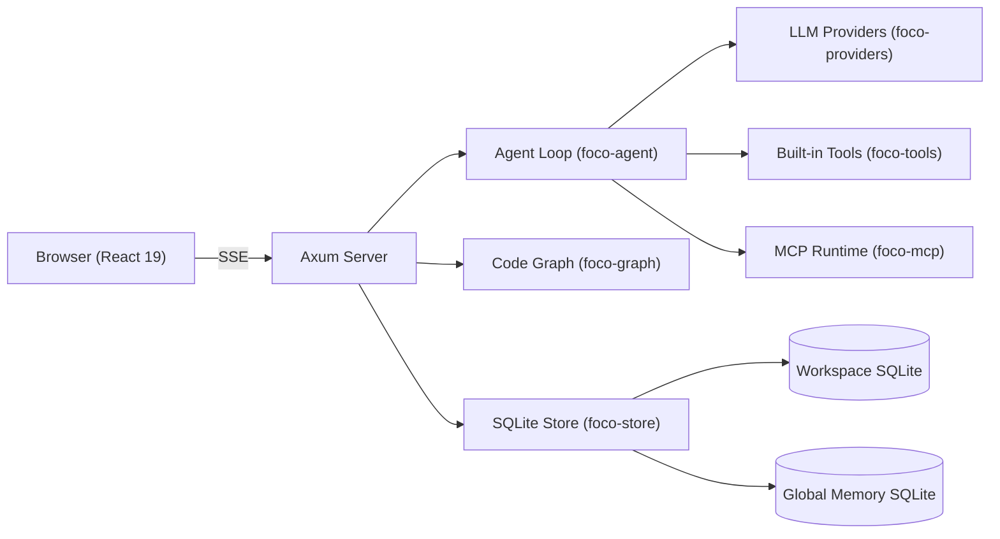

# Foco

<div align="center">


**Your local AI coding agent — precise execution, strict safety, long-term solutions.**

[](LICENSE)
[](https://www.rust-lang.org/)
[](https://www.typescriptlang.org/)
[](https://react.dev/)

[English](README.md) | [简体中文](README.zh-CN.md)

</div>

---

Foco is a **local-first AI coding agent** that runs inside your browser-based workspace. It combines a high-performance Rust backend with a modern React/TypeScript frontend, giving you a desktop-grade IDE experience directly in the browser. Foco reads, writes, and edits your code, executes shell commands, indexes your codebase into a semantic graph, and integrates with external tools through the Model Context Protocol (MCP).

## ✨ Key Features

- **🖥️ Browser-Native Desktop Experience** — Runs locally (default `127.0.0.1:33210`), serves the frontend from embedded assets. Works on Windows, macOS, and Linux with a Windows system tray on release builds.
- **🧠 Full Agent Loop** — Multi-turn conversational agent with tool calling, reasoning display, streaming responses via SSE, and an interactive todo graph.
- **📊 Semantic Code Graph** — Indexes your workspace with tree-sitter parsers for 12 languages (C, C#, C++, Go, Java, JavaScript, JSON, Python, Rust, TOML, TypeScript, and more). In-file symbol search, call graph navigation, and related-file discovery.
- **🔧 Rich Built-in Tools** — `read_file`, `write_file`, `edit_file`, `find_files`, `search_text` (ripgrep), `run_command`, `web_search`, `web_fetch`, `graph_*` (6 code graph tools), `create_todo_graph`, `update_todo_graph`, `get_todo_graph`, `ask_question`, `sleep`.
- **🔌 MCP Support** — Extend Foco with any Model Context Protocol server (stdio or streamable-http). Windows stdio MCP uses Job Objects for clean process tree management.
- **💾 Persistent Memory** — Three scopes (global, workspace, chat). Automatic extraction and retrieval via LLM. FTS and LLM-based memory selection. Paginated memory browsing in the UI.
- **🪝 Claude Code-Compatible Hooks** — Configure `PreToolUse`, `PostToolUse`, `Stop`, `SubagentStop`, and more. Global and per-workspace hooks with audit logging.
- **📋 Skills System** — Discoverable skill files (YAML frontmatter + instructions) from shared and workspace-local directories. Skills inject context into new chats.
- **🖥️ Integrated Terminal** — Browser-based terminal panel via xterm.js + WebSocket, with session management, shell selection (powershell/cmd/bash/zsh), and WebSocket heartbeat keepalive.
- **📈 AI Statistics Dashboard** — Request audit trail with paginated detail views, trend charts (Recharts), model/provider breakdowns, and configurable columns.
- **🔐 Secure by Default** — Optional browser password auth, sanitized audit logs (no API keys/credentials stored), workspace-scoped file access, strict path validation.
- **🎨 Modern UI** — Tailwind CSS, Lucide icons, dark theme. Responsive layout with mobile support. Mermaid diagram rendering in chat. Real-time markdown streaming.
- **📦 Multi-Workspace** — Manage multiple projects with per-workspace SQLite databases, configs, hooks, skills, and memory. Workspace logos with SVG support.

## 🏗️ Architecture



| Crate | Purpose |
|---|---|
| `foco-app` | HTTP server (axum), routes, config, tray icon, entrypoint |
| `foco-agent` | Agent loop, prompt assembly, tool execution planning |
| `foco-providers` | LLM provider abstraction via `genai`, proxy support, error diagnostics |
| `foco-tools` | Built-in tool definitions and execution (files, search, git, web, todo) |
| `foco-graph` | Code graph indexing with tree-sitter, incremental updates via content hash |
| `foco-mcp` | Model Context Protocol client, process management, tool proxies |
| `foco-store` | SQLite persistence, migrations, audit, memory CRUD |

## 🚀 Quick Start

### Prerequisites

- [Rust](https://rustup.rs/) (stable, edition 2024)
- [Node.js](https://nodejs.org/) 20+ and npm
- Windows: PowerShell 5.1+ or PowerShell Core

### Setup

```bash
# Clone the repository
git clone https://github.com/your-org/foco.git
cd foco

# Install frontend dependencies
npm install

# Build the frontend (required even for development)
npm run build -w web
```

### Development

```bash
# Start backend (default port 33210, config dir ~/.foco-dev)
npm run backend

# Start frontend dev server (Vite, port 5174)
npm run frontend

# Or on Windows — one-click dual-process launch:
start-dev.bat
```

### Full Verification

```bash
# Run all tests (Rust workspace + frontend tests + typecheck)
npm test
```

### Release Build

```bash
npm run build:release
```

On Windows, this produces a standalone binary with system tray support.

## 🛠️ Built-in Tools Reference

| Tool | Description |
|---|---|
| `read_file` | Read a file with optional line range |
| `write_file` | Create or overwrite a file, or replace a line range |
| `edit_file` | Precise string replacement in existing files |
| `find_files` | Recursive file listing with glob include/exclude |
| `search_text` | Ripgrep-powered full-text search |
| `run_command` | Execute shell commands with live output streaming |
| `web_search` | Web search via configured search API |
| `web_fetch` | Fetch and parse web pages with line-range support |
| `graph_explore` | Read source context around indexed symbols |
| `graph_find_symbols` | Search code graph symbols by name |
| `graph_find_callers` | Find callers of a symbol |
| `graph_find_callees` | Find callees of a symbol |
| `graph_find_references` | Find all references to a symbol |
| `graph_related_files` | Discover files related by imports or graph edges |
| `create_todo_graph` | Create a structured task graph |
| `update_todo_graph` | Patch a single task in the graph |
| `get_todo_graph` | Read the current todo graph |
| `ask_question` | Ask the user one or more blocking questions |
| `sleep` | Pause tool execution |

## 🔧 Configuration

Foco uses a strict JSON schema for its global configuration. On first launch, it creates:

```
~/.foco/
├── config.json          # Global config (providers, models, hooks, workspaces, memory settings)
├── memory.sqlite        # Global memory database
├── logs/
│   └── foco-YYYY-MM-DD.log
└── (workspaces)
```

Each workspace has:

```
<workspace>/.foco/
├── foco.sqlite          # Chats, messages, tool calls, code graph, LLM audit
├── hooks.json           # Per-workspace hooks
└── backups/             # SQLite pre-migration backups
```

### Environment Variables

| Variable | Default | Description |
|---|---|---|
| `FOCO_HOST` | `127.0.0.1` | Server bind address |
| `FOCO_PORT` | `33210` | Server listen port |
| `FOCO_CONFIG_DIR` | `%USERPROFILE%\.foco` | Configuration root directory |

### Provider Proxy

Per-provider HTTP/SOCKS proxy configuration with strict validation of scheme, URL, and credentials.

## 📁 Project Layout

```
.
├── app/                 # foco-app — axum server, routes, CLI entrypoint
│   ├── main.rs          # Server startup, routes, SSE streaming, chat API
│   └── build.rs         # Windows icon resource embedding
├── agent/               # foco-agent — agent loop, prompt assembly, tool planning
│   └── lib.rs
├── providers/           # foco-providers — LLM abstraction, stream, proxy
│   └── lib.rs
├── tools/               # foco-tools — built-in tool definitions and execution
│   └── lib.rs
├── graph/               # foco-graph — tree-sitter code indexing, watcher
│   └── lib.rs
├── mcp/                 # foco-mcp — MCP client, process lifecycle
│   └── lib.rs
├── store/               # foco-store — SQLite persistence, migrations, memory
│   └── lib.rs
├── web/                 # React 19 + TypeScript + Tailwind frontend
│   ├── App.tsx          # Main application component
│   ├── main.tsx         # React entry point
│   ├── styles.css       # Global styles
│   └── dist/            # Built frontend (embedded by rust-embed)
├── scripts/             # Dev helpers (backend, frontend, smoke tests)
├── start-dev.bat        # Windows dual-process launcher
├── Cargo.toml           # Rust workspace root
├── package.json         # npm workspace root
└── foco.svg             # Application icon
```

## 🧪 Technology Stack

**Backend:**
- [Rust](https://www.rust-lang.org/) (edition 2024)
- [axum](https://github.com/tokio-rs/axum) — HTTP framework with WebSocket support
- [tokio](https://tokio.rs/) — Async runtime
- [rusqlite](https://github.com/rusqlite/rusqlite) — SQLite (bundled)
- [gix](https://github.com/GitoxideLabs/gitoxide) — Pure Rust Git implementation
- [tree-sitter](https://tree-sitter.github.io/) — Incremental parsing for code graph
- [genai](https://github.com/jeremychone/rust-genai) — LLM provider abstraction
- [rmcp](https://crates.io/crates/rmcp) — Model Context Protocol client
- [portable-pty](https://github.com/oconnor663/portable-pty.rs) — Cross-platform PTY

**Frontend:**
- [React 19](https://react.dev/)
- [TypeScript](https://www.typescriptlang.org/)
- [Tailwind CSS](https://tailwindcss.com/)
- [Vite](https://vitejs.dev/)
- [xterm.js](https://xtermjs.org/) — Terminal emulator
- [Mermaid](https://mermaid.js.org/) — Diagram rendering
- [Recharts](https://recharts.org/) — Statistics charts
- [Lucide](https://lucide.dev/) — Icons
- [react-markdown](https://github.com/remarkjs/react-markdown) — Markdown rendering
- [Vitest](https://vitest.dev/) — Testing

## 📄 License

MIT
