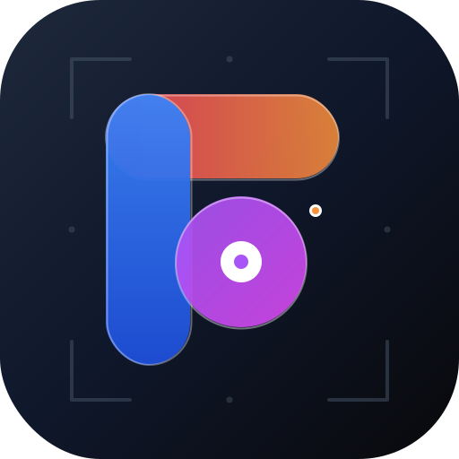
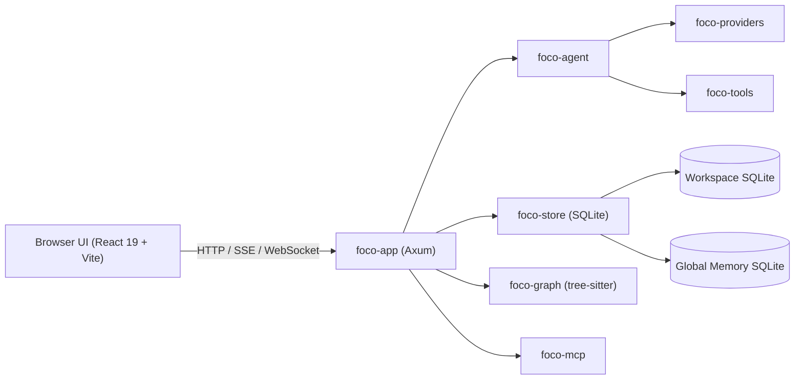

# Foco

<div align="center">



**A local-first AI coding workspace with agents, tools, memory, and project automation.**

[](LICENSE)
[](https://www.rust-lang.org/)
[](https://www.typescriptlang.org/)
[](https://react.dev/)

[English](README.md) | [简体中文](README.zh-CN.md)

</div>

---

Foco is a local AI coding workspace that pairs a Rust backend with a React/TypeScript frontend. It runs on your machine, serves a browser UI, keeps workspace data in SQLite, and gives coding agents controlled access to files, commands, code search, memory, MCP tools, hooks, terminals, Git state, and scheduled automation.

## What It Does

- **Chat-driven coding agent**: streaming chat runs, tool calls, attachments, task state, cancellation, context usage, and chat-level statistics.
- **Agent teams**: configurable agent definitions, instances, delegated tasks, queues, team snapshots, and permission-scoped tools.
- **Workspace tools**: file reads/writes/edits, ripgrep search, shell command execution, web search/fetch, todo graphs, blocking questions, sleep, and code graph queries.
- **Semantic code graph**: tree-sitter indexing for common languages including Rust, TypeScript, JavaScript, Python, Go, Java, C/C++, C#, JSON, TOML, YAML, CSS, Bash, PHP, Ruby, Swift, Kotlin, Lua, Vue, and container files.
- **Model and provider management**: provider configuration, model metadata refresh, retry settings, request overrides, per-provider proxy support, and OpenAI Responses support.
- **Persistent memory**: global, workspace, and chat memory with manual notes, extraction jobs, retrieval, sources, expiration, and memory dream review workflows.
- **Project spec support**: automatic or manual workspace spec generation and updates that can be injected into chat context.
- **MCP integration**: stdio and streamable HTTP MCP servers, exposed as tool proxies for agents.
- **Hooks and skills**: Claude Code-style hooks, hook audit logs, imported hook config, and skill files discovered from global and workspace roots.
- **Integrated work surfaces**: multi-workspace management, browser terminal, Git status/diff/branch tools, scheduled tasks, AI request statistics, and light/dark UI.

## Architecture



| Crate | Purpose |
|---|---|
| `foco-app` | Axum HTTP server, routing, SSE/WebSocket runtime, settings, terminal, Git, hooks, memory, scheduled tasks, and app entrypoint |
| `foco-agent` | Agent run planning, context packing, prompt budgeting, team/task execution, and event emission |
| `foco-providers` | LLM provider abstraction, streaming, request overrides, proxy handling, and diagnostics |
| `foco-tools` | Built-in tool definitions and execution for files, commands, search, web, graph, todo, and agent teams |
| `foco-graph` | Tree-sitter code graph indexing, symbol search, references, callers/callees, and related files |
| `foco-mcp` | MCP client runtime, stdio/streamable HTTP transport, server state, and tool definitions |
| `foco-store` | Global config, workspace SQLite databases, migrations, audit records, memory, and model metadata |

The main frontend and backend entry files are kept as assembly layers. `web/App.tsx` owns shell-level routing, active workspace/chat coordination, and cross-feature state, while feature UI lives under `web/features/`. `app/main.rs` owns process startup, global state wiring, and runtime boot order, while HTTP routes, platform code, native tools, code graph startup, chat run adaptation, memory, prompt, scheduled task, and store concerns live in their domain modules.

## Quick Start

### Prerequisites

- [Rust](https://rustup.rs/) stable with edition 2024 support
- [Node.js](https://nodejs.org/) 20+ and npm
- `ripgrep` is recommended; the app can also use its configured native tool installer/status flow
- Windows: PowerShell 5.1+ or PowerShell Core for the default terminal shell

### Install

```bash
git clone https://github.com/your-org/foco.git
cd foco
npm install
```

### Development

Start the backend. This builds the frontend once, runs `cargo run -p foco-app`, and restarts when Rust sources change.

```bash
npm run backend
```

Start the Vite frontend in another terminal. It proxies `/api` and WebSocket traffic to the configured backend endpoint.

```bash
npm run frontend
```

Defaults:

- App backend: `http://127.0.0.1:3210`
- Vite frontend: `http://127.0.0.1:5173` unless Vite selects another free port
- Config directory: `~/.foco` or `%USERPROFILE%\.foco`

You can override the backend endpoint and config directory:

```bash
npm run backend -- --port 33210 --config-dir ~/.foco-dev
npm run frontend -- --backend-port 33210 --config-dir ~/.foco-dev --port 16000
```

On Windows, `start-dev.bat` launches both processes with the development defaults `33210`, `%USERPROFILE%\.foco-dev`, and frontend port `16000`.

### Verification

```bash
npm test
```

This runs the Rust workspace tests, frontend Vitest suite, and TypeScript typecheck.

Useful focused commands:

```bash
cargo test --workspace
npm run test -w web
npm run typecheck -w web
```

### Release Build

```bash
npm run build:release
```

This builds the web assets and then runs `cargo build --release -p foco-app`. On Windows release builds, the app uses the Windows subsystem setting and embeds the app icon resource.

## Configuration And Data

Foco stores global config and app-level data under the configured root directory. By default that is `~/.foco` on Unix-like systems and `%USERPROFILE%\.foco` on Windows. Set `FOCO_CONFIG_DIR` to use a different root.

```text
~/.foco/
├── config.json          # Global app config: server, providers, models, workspaces, memory, hooks, skills, agents, prompts
├── memory.sqlite        # Global memory database
├── logs/                # Daily app logs
└── workspace/           # Default managed workspace root used by first-run config
```

Each project workspace can also contain workspace-local Foco data:

```text
<workspace>/.foco/
├── foco.sqlite          # Chats, messages, tool calls, code graph, LLM audit, specs, scheduled tasks
├── hooks.json           # Workspace hooks
└── backups/             # SQLite backups created before migrations
```

Environment variables:

| Variable | Default | Description |
|---|---|---|
| `FOCO_HOST` | `127.0.0.1` | One-start override for the backend listen host |
| `FOCO_PORT` | `3210` | One-start override for the backend listen port |
| `FOCO_CONFIG_DIR` | user profile `/.foco` | Global configuration and data root |

The same values can be passed to the npm development scripts with `--host`, `--port` / `--backend-port`, and `--config-dir`.

## Built-in Agent Tools

Foco exposes a strict set of built-in tools to chat runs:

- Files and search: `read_file`, `write_file`, `edit_file`, `find_files`, `search_text`
- Commands and timing: `run_command`, `sleep`
- Web: `web_search`, `web_fetch`
- Code graph: `graph_explore`, `graph_find_symbols`, `graph_find_callers`, `graph_find_callees`, `graph_find_references`, `graph_related_files`
- Task state: `create_todo_graph`, `update_todo_graph`, `get_todo_graph`, `ask_question`
- Agent teams: `agent_list`, `agent_get_task`, `agent_send_message`, `agent_delegate_task`, `agent_cancel_task`, `agent_wait_tasks`, `agent_transfer_task`, `agent_create_instances`
- Memory tools are added by the app runtime when memory is enabled.

## Project Layout

```text
.
├── app/                 # Axum app, HTTP routes, runtime orchestration, terminal, Git, memory, hooks, spec, scheduled tasks
├── agent/               # Agent planning, context handling, team/task runtime primitives
├── providers/           # LLM provider abstraction and streaming requests
├── tools/               # Built-in tool schemas and local execution
├── graph/               # Tree-sitter code graph indexing and queries
├── mcp/                 # MCP client runtime and transports
├── store/               # Config, SQLite schemas, migrations, memory and workspace persistence
├── web/                 # React 19 frontend, Vite config, tests, feature panels, shared API types
├── scripts/             # Development and release smoke-test helpers
├── start-dev.bat        # Windows two-process development launcher
├── Cargo.toml           # Rust workspace root
├── package.json         # npm workspace root
└── foco.svg             # Application icon
```

## Frontend Stack

- React 19, TypeScript, Vite, Tailwind CSS
- Lucide React icons
- xterm.js terminal
- Recharts statistics views
- Monaco Editor for rich text/code editing surfaces
- react-markdown, remark-gfm, remark-math, rehype-katex, Mermaid, and KaTeX for chat rendering
- Vitest and Testing Library for frontend tests

## License

MIT
