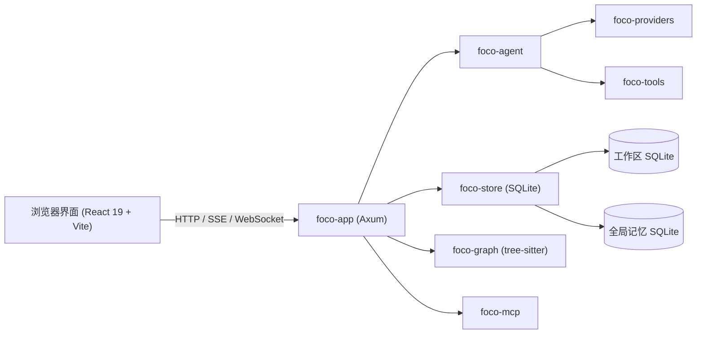

# Foco

<div align="center">


**本地优先的 AI 编程工作区，内置智能体、工具、记忆与项目自动化。**

[](LICENSE)
[](https://www.rust-lang.org/)
[](https://www.typescriptlang.org/)
[](https://react.dev/)

[English](README.md) | [简体中文](README.zh-CN.md)

</div>

---

Foco 是一个本地 AI 编程工作区，使用 Rust 后端和 React/TypeScript 前端构建。它在你的机器上运行，提供浏览器界面，用 SQLite 保存工作区数据，并让编程智能体在受控范围内使用文件、命令、代码搜索、记忆、MCP 工具、Hooks、终端、Git 状态和定时自动化能力。

## 能做什么

- **对话式编程智能体**：支持流式会话、工具调用、附件、任务状态、取消运行、上下文用量和会话级统计。
- **智能体团队**：支持配置智能体定义、实例、委派任务、队列、团队快照以及按权限限定工具。
- **工作区工具**：文件读写编辑、ripgrep 搜索、Shell 命令执行、网页搜索/抓取、任务图、阻塞式提问、暂停和代码图谱查询。
- **语义代码图谱**：使用 tree-sitter 索引常见语言，包括 Rust、TypeScript、JavaScript、Python、Go、Java、C/C++、C#、JSON、TOML、YAML、CSS、Bash、PHP、Ruby、Swift、Kotlin、Lua、Vue 和容器文件。
- **模型与提供商管理**：提供商配置、模型元数据刷新、重试设置、请求覆盖、按提供商代理配置以及 OpenAI Responses 支持。
- **持久化记忆**：全局、工作区和会话三类记忆，支持手动笔记、抽取任务、检索、来源、过期和 memory dream 审阅流程。
- **项目 Spec 支持**：可自动或手动生成、更新工作区 Spec，并注入到会话上下文。
- **MCP 集成**：支持 stdio 和 streamable HTTP MCP 服务器，并将其作为智能体可用的工具代理。
- **Hooks 与 Skills**：支持 Claude Code 风格 Hooks、Hook 审计日志、导入 Hook 配置，以及从全局和工作区目录发现技能文件。
- **集成工作界面**：多工作区管理、浏览器终端、Git 状态/diff/分支工具、定时任务、AI 请求统计，以及浅色/深色界面。

## 架构



| Crate | 用途 |
|---|---|
| `foco-app` | Axum HTTP 服务、路由、SSE/WebSocket 运行时、设置、终端、Git、Hooks、记忆、定时任务和应用入口 |
| `foco-agent` | 智能体运行规划、上下文打包、提示预算、团队/任务执行和事件发送 |
| `foco-providers` | LLM 提供商抽象、流式响应、请求覆盖、代理处理和诊断 |
| `foco-tools` | 文件、命令、搜索、网页、图谱、任务和智能体团队等内置工具的定义与执行 |
| `foco-graph` | tree-sitter 代码图谱索引、符号搜索、引用、调用方/被调用方和相关文件 |
| `foco-mcp` | MCP 客户端运行时、stdio/streamable HTTP 传输、服务器状态和工具定义 |
| `foco-store` | 全局配置、工作区 SQLite 数据库、迁移、审计记录、记忆和模型元数据 |

前端和后端主入口文件保持为装配层。`web/App.tsx` 负责 shell 级路由、当前工作区/聊天协调和跨 feature 状态，具体功能 UI 放在 `web/features/`。`app/main.rs` 负责进程启动、全局状态接线和运行时启动顺序，HTTP 路由、平台代码、原生工具、code graph 启动、聊天运行适配、记忆、提示词、定时任务和存储逻辑放在各自领域模块。

## 快速开始

### 前提条件

- [Rust](https://rustup.rs/) stable，并支持 edition 2024
- [Node.js](https://nodejs.org/) 20+ 和 npm
- 推荐安装 `ripgrep`；应用也包含原生工具安装/状态流程
- Windows：默认终端 Shell 需要 PowerShell 5.1+ 或 PowerShell Core

### 安装

```bash
git clone https://github.com/your-org/foco.git
cd foco
npm install
```

### 开发模式

启动后端。该命令会先构建一次前端，然后运行 `cargo run -p foco-app`，并在 Rust 源码变化时重启。

```bash
npm run backend
```

在另一个终端启动 Vite 前端。它会把 `/api` 和 WebSocket 流量代理到配置的后端地址。

```bash
npm run frontend
```

默认值：

- 应用后端：`http://127.0.0.1:3210`
- Vite 前端：`http://127.0.0.1:5173`，除非 Vite 选择了其他空闲端口
- 配置目录：`~/.foco` 或 `%USERPROFILE%\.foco`

可以覆盖后端地址和配置目录：

```bash
npm run backend -- --port 33210 --config-dir ~/.foco-dev
npm run frontend -- --backend-port 33210 --config-dir ~/.foco-dev --port 16000
```

Windows 上可以运行 `start-dev.bat` 同时启动两个进程，默认使用后端端口 `33210`、配置目录 `%USERPROFILE%\.foco-dev` 和前端端口 `16000`。

### 验证

```bash
npm test
```

该命令会运行 Rust workspace 测试、前端 Vitest 测试和 TypeScript 类型检查。

常用的局部命令：

```bash
cargo test --workspace
npm run test -w web
npm run typecheck -w web
```

### Release 构建

```bash
npm run build:release
```

该命令会构建 Web 资源，然后运行 `cargo build --release -p foco-app`。Windows release 构建会启用 Windows subsystem 设置并嵌入应用图标资源。

## 配置与数据

Foco 会把全局配置和应用级数据存放在配置根目录下。默认路径在类 Unix 系统上是 `~/.foco`，在 Windows 上是 `%USERPROFILE%\.foco`。可以通过 `FOCO_CONFIG_DIR` 指定其他根目录。

```text
~/.foco/
├── config.json          # 全局应用配置：服务、提供商、模型、工作区、记忆、Hooks、Skills、Agents、Prompts
├── memory.sqlite        # 全局记忆数据库
├── logs/                # 按天写入的应用日志
└── workspace/           # 首次运行配置使用的默认托管工作区根目录
```

每个项目工作区也可以包含工作区本地的 Foco 数据：

```text
<workspace>/.foco/
├── foco.sqlite          # 会话、消息、工具调用、代码图谱、LLM 审计、Specs、定时任务
├── hooks.json           # 工作区 Hooks
└── backups/             # 迁移前创建的 SQLite 备份
```

环境变量：

| 变量 | 默认值 | 说明 |
|---|---|---|
| `FOCO_HOST` | `127.0.0.1` | 后端监听地址的一次性启动覆盖 |
| `FOCO_PORT` | `3210` | 后端监听端口的一次性启动覆盖 |
| `FOCO_CONFIG_DIR` | 用户目录下的 `/.foco` | 全局配置与数据根目录 |

同样的值也可以通过 npm 开发脚本参数传入：`--host`、`--port` / `--backend-port` 和 `--config-dir`。

## 内置智能体工具

Foco 会向会话运行暴露一组严格定义的内置工具：

- 文件与搜索：`read_file`、`write_file`、`edit_file`、`find_files`、`search_text`
- 命令与时间：`run_command`、`sleep`
- 网页：`web_search`、`web_fetch`
- 代码图谱：`graph_explore`、`graph_find_symbols`、`graph_find_callers`、`graph_find_callees`、`graph_find_references`、`graph_related_files`
- 任务状态：`create_todo_graph`、`update_todo_graph`、`get_todo_graph`、`ask_question`
- 智能体团队：`agent_list`、`agent_get_task`、`agent_send_message`、`agent_delegate_task`、`agent_cancel_task`、`agent_wait_tasks`、`agent_transfer_task`、`agent_create_instances`
- 记忆工具会在启用记忆时由应用运行时加入。

## 项目结构

```text
.
├── app/                 # Axum 应用、HTTP 路由、运行时编排、终端、Git、记忆、Hooks、Spec、定时任务
├── agent/               # 智能体规划、上下文处理、团队/任务运行时基础能力
├── providers/           # LLM 提供商抽象和流式请求
├── tools/               # 内置工具 schema 与本地执行
├── graph/               # tree-sitter 代码图谱索引与查询
├── mcp/                 # MCP 客户端运行时与传输
├── store/               # 配置、SQLite schema、迁移、记忆和工作区持久化
├── web/                 # React 19 前端、Vite 配置、测试、功能面板、共享 API 类型
├── scripts/             # 开发和 release 冒烟测试辅助脚本
├── start-dev.bat        # Windows 双进程开发启动脚本
├── Cargo.toml           # Rust workspace 根配置
├── package.json         # npm workspace 根配置
└── foco.svg             # 应用图标
```

## 前端技术栈

- React 19、TypeScript、Vite、Tailwind CSS
- Lucide React 图标
- xterm.js 终端
- Recharts 统计视图
- Monaco Editor，用于富文本/代码编辑界面
- react-markdown、remark-gfm、remark-math、rehype-katex、Mermaid 和 KaTeX，用于会话渲染
- Vitest 和 Testing Library，用于前端测试

## 许可证

MIT
