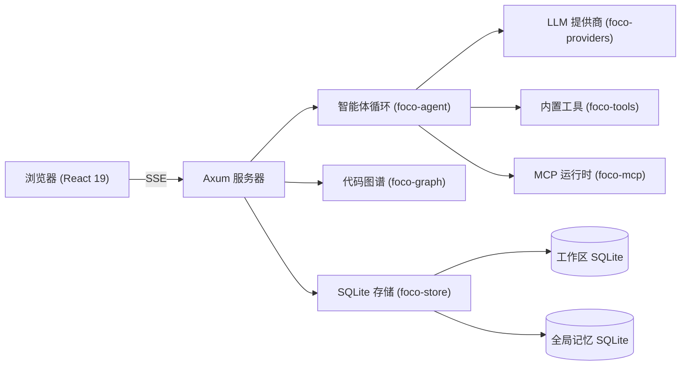

# Foco

<div align="center">


**你的本地 AI 编程智能体——精确执行，严格安全，长期方案。**

[](LICENSE)
[](https://www.rust-lang.org/)
[](https://www.typescriptlang.org/)
[](https://react.dev/)

[English](README.md) | [简体中文](README.zh-CN.md)

</div>

---

Foco 是一个**本地优先的 AI 编程智能体**，运行在基于浏览器的工作区内。它将高性能 Rust 后端与现代 React/TypeScript 前端相结合，在浏览器中提供桌面级 IDE 体验。Foco 可以读取、写入和编辑你的代码，执行 Shell 命令，将代码库索引成语义图谱，并通过模型上下文协议（MCP）集成外部工具。

## ✨ 核心功能

- **🖥️ 浏览器原生桌面体验**——本地运行（默认 `127.0.0.1:33210`），通过内嵌资源提供前端。支持 Windows、macOS 和 Linux，Release 构建带 Windows 系统托盘。
- **🧠 完整智能体循环**——多轮对话智能体，支持工具调用、推理过程展示、通过 SSE 流式响应以及交互式任务图谱。
- **📊 语义代码图谱**——使用 tree-sitter 解析器索引工作区，支持 12 种编程语言（C、C#、C++、Go、Java、JavaScript、JSON、Python、Rust、TOML、TypeScript 等）。提供文件内符号搜索、调用图导航及相关文件发现。
- **🔧 丰富的内置工具**——`read_file`、`write_file`、`edit_file`、`find_files`、`search_text`（ripgrep 全文搜索）、`run_command`、`web_search`、`web_fetch`、`graph_*`（6 个代码图谱工具）、`create_todo_graph`、`update_todo_graph`、`get_todo_graph`、`ask_question`、`sleep`。
- **🔌 MCP 支持**——通过任何模型上下文协议服务器扩展 Foco（支持 stdio 或 streamable-http 传输）。Windows stdio MCP 使用 Job Object 实现干净的进程树管理，避免孤儿进程残留。
- **💾 持久化记忆**——三种作用域（全局、工作区、会话）。通过 LLM 自动抽取和检索。支持全文搜索和基于 LLM 的记忆选择。界面中提供带分页的记忆浏览。
- **🪝 Claude Code 兼容的 Hooks**——配置 `PreToolUse`、`PostToolUse`、`Stop`、`SubagentStop` 等事件钩子。支持全局和工作区级别的 hooks，带审计日志。
- **📋 技能系统**——从共享目录和工作区本地目录发现技能文件（YAML frontmatter + 指令）。技能向新会话注入上下文。
- **🖥️ 集成终端**——通过 xterm.js + WebSocket 实现浏览器内终端面板，支持会话管理、Shell 选择（powershell/cmd/bash/zsh）以及 WebSocket 心跳保活。
- **📈 AI 用量统计面板**——请求审计追踪，支持分页详情视图、趋势图表（Recharts）、模型/提供商分解以及可配置列。
- **🔐 默认安全**——可选的浏览器密码认证，脱敏审计日志（不存储 API 密钥/凭据），工作区限定文件访问，严格路径校验。
- **🎨 现代 UI**——Tailwind CSS 样式、Lucide 图标、深色主题。响应式布局支持移动端。聊天中支持 Mermaid 图表渲染。实时 Markdown 流式渲染。
- **📦 多工作区**——管理多个项目，每个工作区拥有独立的 SQLite 数据库、配置、hooks、技能和记忆。支持 SVG 格式的工作区图标。

## 🏗️ 架构



| Crate | 用途 |
|---|---|
| `foco-app` | HTTP 服务器（axum）、路由、配置、系统托盘、入口 |
| `foco-agent` | 智能体循环、提示组装、工具执行规划 |
| `foco-providers` | 基于 `genai` 的 LLM 提供商抽象，代理支持，错误诊断 |
| `foco-tools` | 内置工具定义与执行（文件、搜索、Git、网页、任务） |
| `foco-graph` | 基于 tree-sitter 的代码图谱索引，通过内容哈希实现增量更新 |
| `foco-mcp` | 模型上下文协议客户端、进程管理、工具代理 |
| `foco-store` | SQLite 持久化、数据库迁移、审计、记忆 CRUD |

## 🚀 快速开始

### 前提条件

- [Rust](https://rustup.rs/)（stable，edition 2024）
- [Node.js](https://nodejs.org/) 20+ 和 npm
- Windows：PowerShell 5.1+ 或 PowerShell Core

### 安装配置

```bash
# 克隆仓库
git clone https://github.com/your-org/foco.git
cd foco

# 安装前端依赖
npm install

# 构建前端（开发模式下也必须构建）
npm run build -w web
```

### 开发模式

```bash
# 启动后端（默认端口 33210，配置目录 ~/.foco-dev）
npm run backend

# 启动前端开发服务器（Vite，端口 5174）
npm run frontend

# Windows 上一键双进程启动：
start-dev.bat
```

### 全量验证

```bash
# 运行所有测试（Rust 工作区测试 + 前端测试 + 类型检查）
npm test
```

### Release 构建

```bash
npm run build:release
```

在 Windows 上，将生成带系统托盘支持的独立可执行文件。

## 🛠️ 内置工具参考

| 工具 | 说明 |
|---|---|
| `read_file` | 读取文件，支持指定行范围 |
| `write_file` | 创建或覆盖文件，或替换指定行范围 |
| `edit_file` | 在已有文件中进行精确字符串替换 |
| `find_files` | 递归列出文件，支持 glob 包含/排除模式 |
| `search_text` | 基于 ripgrep 的全文搜索 |
| `run_command` | 执行 Shell 命令，支持实时输出流 |
| `web_search` | 通过配置的搜索 API 进行网页搜索 |
| `web_fetch` | 抓取并解析网页，支持行范围读取 |
| `graph_explore` | 读取已索引符号周围的源代码上下文 |
| `graph_find_symbols` | 按名称搜索代码图谱中的符号 |
| `graph_find_callers` | 查找符号的调用者 |
| `graph_find_callees` | 查找符号调用的目标 |
| `graph_find_references` | 查找符号的所有引用 |
| `graph_related_files` | 发现由导入或图谱边关联的文件 |
| `create_todo_graph` | 创建结构化任务图谱 |
| `update_todo_graph` | 更新图谱中的单个任务 |
| `get_todo_graph` | 读取当前任务图谱 |
| `ask_question` | 向用户提出一个或多个阻塞式问题 |
| `sleep` | 暂停工具执行 |

## 🔧 配置

Foco 使用严格的 JSON schema 管理全局配置。首次启动时将创建：

```
~/.foco/
├── config.json          # 全局配置（提供商、模型、hooks、工作区、记忆设置）
├── memory.sqlite        # 全局记忆数据库
├── logs/
│   └── foco-YYYY-MM-DD.log
└── （工作区目录）
```

每个工作区包含：

```
<workspace>/.foco/
├── foco.sqlite          # 会话、消息、工具调用、代码图谱、LLM 审计
├── hooks.json           # 工作区级别 hooks
└── backups/             # SQLite 迁移前备份
```

### 环境变量

| 变量 | 默认值 | 说明 |
|---|---|---|
| `FOCO_HOST` | `127.0.0.1` | 服务器绑定地址 |
| `FOCO_PORT` | `33210` | 服务器监听端口 |
| `FOCO_CONFIG_DIR` | `%USERPROFILE%\.foco` | 配置根目录 |

### 提供商代理

支持按提供商配置 HTTP/SOCKS 代理，包含严格的 scheme、URL 和凭据校验。

## 📁 项目结构

```
.
├── app/                 # foco-app — axum 服务器、路由、CLI 入口
│   ├── main.rs          # 服务器启动、路由、SSE 流、聊天 API
│   └── build.rs         # Windows 图标资源嵌入
├── agent/               # foco-agent — 智能体循环、提示组装、工具规划
│   └── lib.rs
├── providers/           # foco-providers — LLM 抽象、流处理、代理
│   └── lib.rs
├── tools/               # foco-tools — 内置工具定义与执行
│   └── lib.rs
├── graph/               # foco-graph — tree-sitter 代码索引、文件监听
│   └── lib.rs
├── mcp/                 # foco-mcp — MCP 客户端、进程生命周期
│   └── lib.rs
├── store/               # foco-store — SQLite 持久化、迁移、记忆
│   └── lib.rs
├── web/                 # React 19 + TypeScript + Tailwind 前端
│   ├── App.tsx          # 主应用组件
│   ├── main.tsx         # React 入口
│   ├── styles.css       # 全局样式
│   └── dist/            # 构建产物（由 rust-embed 内嵌）
├── scripts/             # 开发辅助脚本（后端、前端、冒烟测试）
├── start-dev.bat        # Windows 双进程启动脚本
├── Cargo.toml           # Rust workspace 根配置
├── package.json         # npm workspace 根配置
└── foco.svg             # 应用图标
```

## 🧪 技术栈

**后端：**
- [Rust](https://www.rust-lang.org/)（edition 2024）
- [axum](https://github.com/tokio-rs/axum)——支持 WebSocket 的 HTTP 框架
- [tokio](https://tokio.rs/)——异步运行时
- [rusqlite](https://github.com/rusqlite/rusqlite)——内嵌 SQLite
- [gix](https://github.com/GitoxideLabs/gitoxide)——纯 Rust 实现的 Git
- [tree-sitter](https://tree-sitter.github.io/)——用于代码图谱的增量解析
- [genai](https://github.com/jeremychone/rust-genai)——LLM 提供商抽象
- [rmcp](https://crates.io/crates/rmcp)——模型上下文协议客户端
- [portable-pty](https://github.com/oconnor663/portable-pty.rs)——跨平台伪终端

**前端：**
- [React 19](https://react.dev/)
- [TypeScript](https://www.typescriptlang.org/)
- [Tailwind CSS](https://tailwindcss.com/)
- [Vite](https://vitejs.dev/)
- [xterm.js](https://xtermjs.org/)——终端模拟器
- [Mermaid](https://mermaid.js.org/)——图表渲染
- [Recharts](https://recharts.org/)——统计图表
- [Lucide](https://lucide.dev/)——图标库
- [react-markdown](https://github.com/remarkjs/react-markdown)——Markdown 渲染
- [Vitest](https://vitest.dev/)——测试框架

## 📄 许可证

MIT
